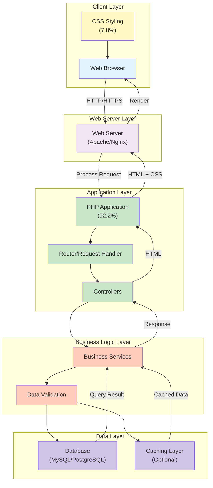

# Architecture Overview

## System Architecture

## Component Description

### Client Layer
- **Web Browser**: Renders HTML and CSS from the server
- **CSS Styling**: Handles presentation and styling (7.8% of codebase)

### Web Server Layer
- **Web Server**: Serves HTTP requests and manages connections (Apache/Nginx)

### Application Layer
- **PHP Application**: Core application logic (92.2% of codebase)
- **Router**: Manages URL routing and request dispatch
- **Controllers**: Handles HTTP request processing and business logic orchestration

### Business Logic Layer
- **Business Services**: Core business logic and operations
- **Data Validation**: Validates input and ensures data integrity

### Data Layer
- **Database**: Persistent data storage
- **Caching Layer**: Optional caching mechanism for performance optimization

## Request Flow

1. Client sends HTTP request via browser
2. Web server receives and forwards to PHP application
3. Router analyzes the request URL
4. Controller handles the request based on route
5. Business services process the logic
6. Validation ensures data integrity
7. Database queries are executed
8. Results are returned and formatted as HTML
9. CSS styling is applied for presentation
10. Response is sent back to the browser for rendering
